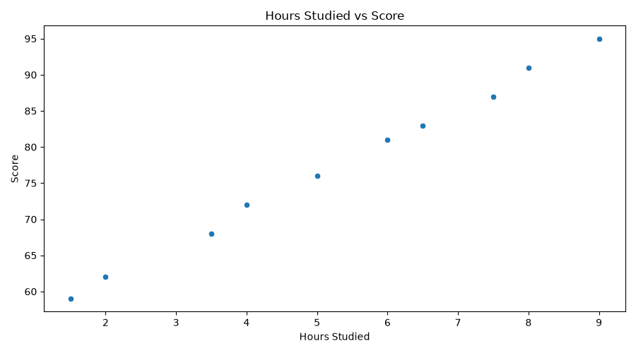
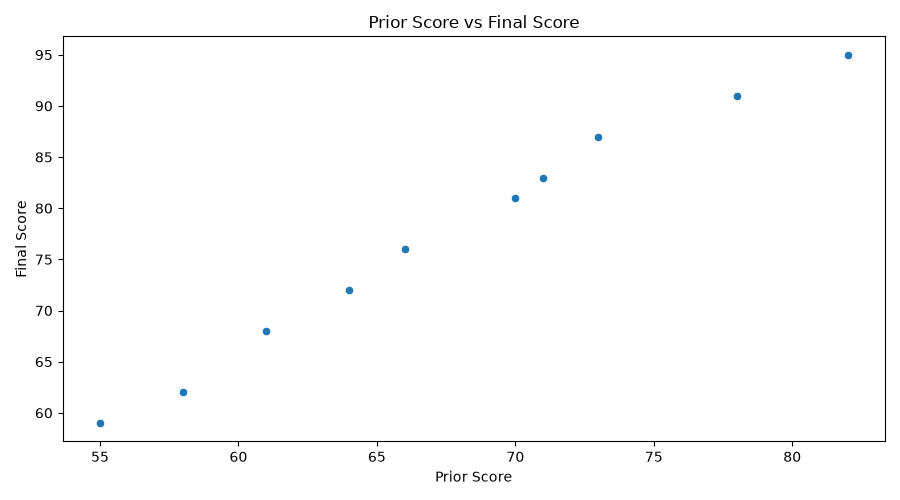
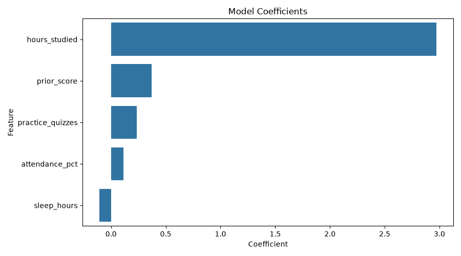

# ml-01-intro

> Professional Python project: Introduction to machine learning problem types and supervised regression.

## Project Description

This project focuses on learning how to identify a good machine learning problem in a dataset.
It introduces the difference between supervised and unsupervised learning, and it shows how to choose a target feature for prediction.

In this project, I worked with a supervised regression example. The model uses student-related features to predict a final score.

The target feature is:

* `score`

The input features are:

* `hours_studied`
* `practice_quizzes`
* `attendance_pct`
* `sleep_hours`
* `prior_score`

Because the target value `score` is numeric, this is a regression problem.

## GitHub Repository

[https://github.com/Airfirm/ml-01-intro]

## Hosted Documentation

[https://airfirm.github.io/ml-01-intro/]

## Links to Project Files

[https://github.com/Airfirm/ml-01-intro/blob/main/src/mlstudio/app_femi.py]
[https://github.com/Airfirm/ml-01-intro/blob/main/tests/test_app_femi.py]
[https://github.com/Airfirm/ml-01-intro/blob/main/notebooks/ml_01_femi.ipynb]

## Project Files

Important files and folders used in this project include:

* `README.md` - main project landing page
* `docs/` - additional project documentation
* `docs/index.md` - project narrative and results
* `docs/project-instructions.md` - project workflow instructions
* `docs/your-files.md` - instructions for naming and creating custom files
* `docs/images/` - saved chart images
* `data/raw/hours_scores_femi.csv` - raw dataset used in my modified project
* `src/mlstudio/app_femi.py` - my modified Python app
* `tests/test_app_femi.py` - smoke test for my app
* `project.log` - log file created when the project runs

## Dataset

The dataset used in my modified project is:

```text
data/raw/hours_scores_femi.csv
```

The dataset has 10 rows and 6 columns.

The columns are:

* `hours_studied`
* `practice_quizzes`
* `attendance_pct`
* `sleep_hours`
* `prior_score`
* `score`

This dataset is used to predict a student’s final score based on study habits, attendance, sleep, and prior academic performance.

## Technical Modification

For my technical modification, I created and modified:

```text
src/mlstudio/app_femi.py
```

I also used my own copied dataset:

```text
data/raw/hours_scores_femi.csv
```

My modification included:

1. Changing the prediction case.
2. Adding a new chart for `prior_score` vs `score`.
3. Logging the technical modification in the summary.
4. Updating the project so charts can be saved automatically to `docs/images/`.

The modified prediction case used:

* `hours_studied`: 8.0
* `practice_quizzes`: 5
* `attendance_pct`: 95
* `sleep_hours`: 7.5
* `prior_score`: 78

The model predicted a final score of:

```text
90.7
```

## Modeling Approach

This project uses supervised machine learning.

I know it is supervised because the dataset includes a target column, `score`, that the model is trying to predict.

This is a regression problem because the target value is numeric and continuous.

The model used is:

```text
LinearRegression
```

The workflow includes:

1. Loading the CSV dataset.
2. Inspecting the data.
3. Checking for missing values and duplicate rows.
4. Creating a clean modeling view.
5. Training a Linear Regression model.
6. Evaluating model performance.
7. Predicting one new case.
8. Creating and saving charts.
9. Writing results to `project.log`.

## Commands Used

Run the modified app from the root project folder:

```shell
uv run python -m mlstudio.app_femi
```

Run the tests:

```shell
uv run python -m pytest
```

Run formatting:

```shell
uv run ruff format .
```

Run linting and automatic fixes:

```shell
uv run ruff check . --fix
```

Run type checking:

```shell
uv run python -m pyright
```

Build documentation:

```shell
uv run python -m zensical build
```

## Example Results

When I ran my modified project, the `project.log` showed that the dataset loaded successfully.

Important results included:

```text
Dataset: hours_scores_femi
Original rows: 10
Clean rows: 10
Features: ['hours_studied', 'practice_quizzes', 'attendance_pct', 'sleep_hours', 'prior_score']
Target: score
Mean absolute error: 0.48
R-squared: 1.00
Predicted score: 90.7
Technical modification: added prior score chart and changed prediction case
Executed successfully!
```

The project found:

* 10 original rows
* 10 clean rows
* 0 missing values
* 0 duplicate rows

The model produced:

* Mean absolute error: `0.48`
* R-squared: `1.00`
* Predicted score for the new case: `90.7`

## Findings and Visuals

The project creates and saves chart images in:

```text
docs/images/
```

### Hours Studied vs Score



This chart shows the relationship between the number of hours studied and the final score.

### Prior Score vs Final Score



This chart shows the relationship between a student’s prior score and final score.

### Model Coefficients



This chart shows how each feature contributed to the Linear Regression model.

## Project Log

A `project.log` file appears in the root project folder after running the app.

The log provides evidence that the project ran successfully.
It records the dataset name, number of rows and columns, missing values, duplicate count, model metrics, prediction result, and workflow completion message.

## Reflection

This project helped me understand how a supervised regression workflow is organized in Python. I learned how the `main()` function controls the project workflow by calling each smaller function in order.

The hardest part was understanding how the app file, dataset file, charts, and log file all connect.
I addressed this by reviewing the example code, making one change at a time, running the project from the terminal, and checking the `project.log`.

This type of workflow could be applied to many real-world prediction problems, such as:

* predicting house prices
* predicting student grades
* predicting sales totals
* predicting customer spending
* predicting employee performance

## Testing

The project includes a smoke test:

```text
tests/test_app_femi.py
```

The test verifies that `app_femi.py` has a callable `main()` function.

To run the test:

```shell
uv run python -m pytest
```

## License

See the project `LICENSE` file.
