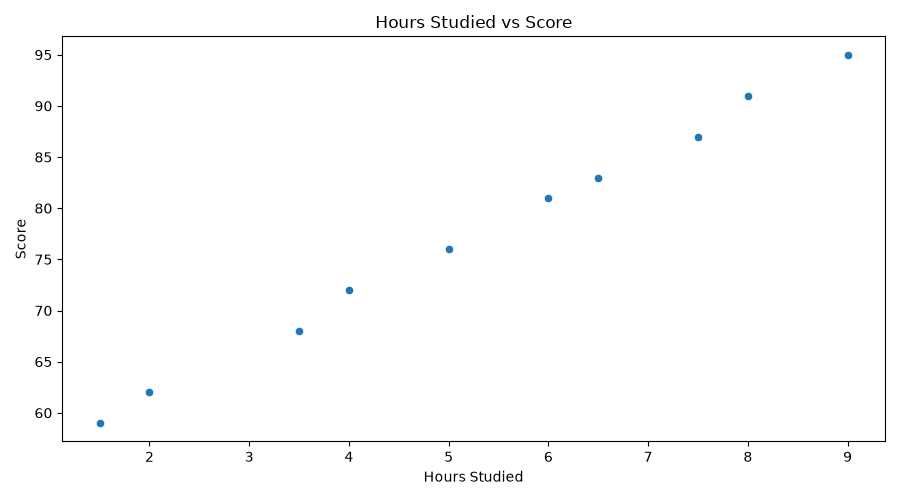
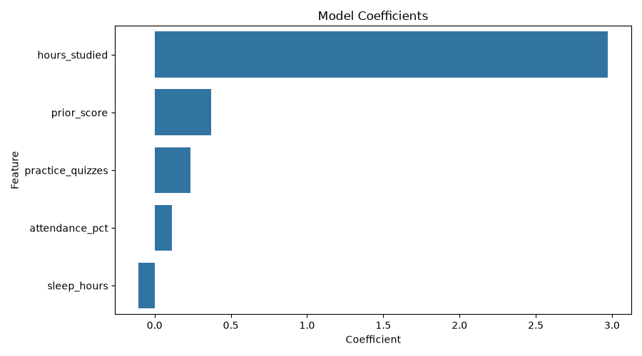
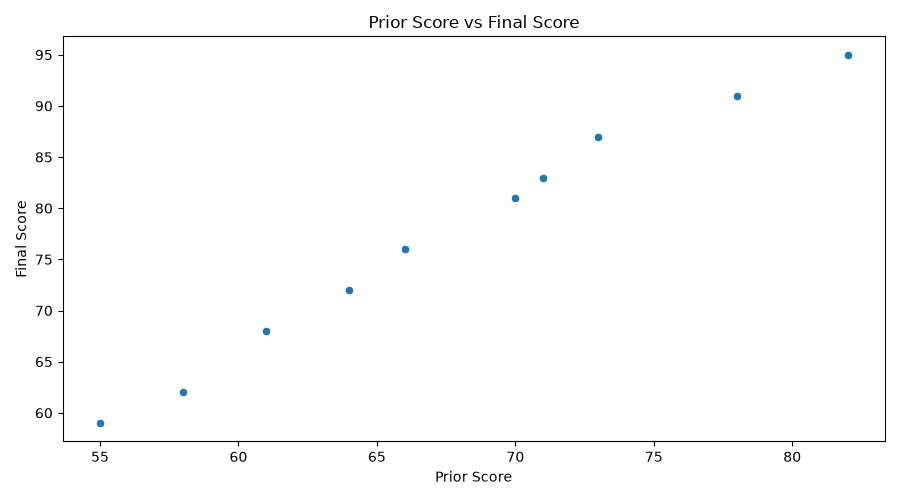

# Project Documentation

## Phase 4. Technical Modification

For my technical modification, I copied and modified the original example project to create my own version named `app_femi.py`. I also used a matching dataset named `hours_scores_femi.csv`.

The original example predicted a student’s final score using study-related features. I kept the same general machine learning workflow, but I changed the prediction example and added an additional chart.
The original project created a chart for **hours studied vs score**.
My modification added a new chart for **prior score vs score** so I could explore another feature that may be useful for predicting the final score.

I also changed the new prediction case. In my version, the model predicts the score for a student with:

* 8.0 hours studied
* 5 practice quizzes
* 95 percent attendance
* 7.5 hours of sleep
* 78 prior score

The model predicted a final score of **90.7** for this new case.

I verified that my modification worked by running:

```shell
uv run python -m mlstudio.app_femi
```

The `project.log` confirmed that the workflow loaded the dataset, checked data quality, trained the Linear Regression model, made a prediction, created charts, and completed successfully.

The log also showed:

```shell
Dataset: hours_scores_femi
Original rows: 10
Clean rows: 10
Features: ['hours_studied', 'practice_quizzes', 'attendance_pct', 'sleep_hours', 'prior_score']
Target: score
Technical modification: added prior score chart and changed prediction case
Executed successfully!
```

Compared with the example project, my version includes an additional visualization and a different prediction case.
This change matters because it gives another way to understand how a student’s previous performance may relate to their final score.

## Phase 5. Custom Project

### Basis and Data

The example dataset I started with was `hours_scores_case.csv`, which was used in the original project. For my modified version, I used `hours_scores_femi.csv`.

The data source is the raw CSV file located in the project folder:

```shell
data/raw/hours_scores_femi.csv
```

The dataset includes 10 rows and 6 columns. The columns are:

* `hours_studied`
* `practice_quizzes`
* `attendance_pct`
* `sleep_hours`
* `prior_score`
* `score`

I kept this type of dataset because it is easy to understand and works well for an introductory machine learning project.
The goal is to predict a student’s final score based on study habits, attendance, sleep, and previous performance.

One important limitation is that the dataset is very small because it only has 10 rows. Because of this, the model results may look very strong, but they may not generalize well to a larger group of students.
Another assumption is that the input features are already clean and numeric, so the project does not require major data cleaning or encoding before modeling.

### Modeling Approach

This project uses a supervised machine learning approach.

I know it is supervised because the dataset includes a target value that the model is trying to predict. The target column is:

```shell
score
```

The features used to predict the target are:

```shell
['hours_studied', 'practice_quizzes', 'attendance_pct', 'sleep_hours', 'prior_score']
```

Since the target value `score` is numeric and continuous, this is a supervised regression problem. The model used in the project is a Linear Regression model.

The workflow includes loading the dataset, inspecting the data, checking for missing values and duplicates,
creating a clean modeling view, training the model, evaluating the model, predicting one new case, and creating charts.

### Summary

I implemented my custom work by creating a modified version of the app named `app_femi.py` and using my own dataset file named `hours_scores_femi.csv`.
I changed the prediction case and added a new chart that compares prior score to final score.

The model loaded 10 rows and 6 columns. It found no missing values and no duplicate rows. After training the Linear Regression model, the results were:

* Mean absolute error: **0.48**
* R-squared: **1.00**
* Predicted score for the new case: **90.7**

The project also created three charts:

* Hours Studied vs Score
* Prior Score vs Score
* Model Coefficients

I learned how a supervised regression workflow is organized in a Python project.
I also learned how the `main()` function controls the order of the workflow by calling each smaller function.
This helped me understand how the project loads data, trains a model, evaluates results, makes a prediction, and creates visualizations.

I exercised the skills covered in this project by modifying an existing example, running the project from the terminal, reviewing the `project.log`, and confirming that the workflow completed successfully.

These tools and techniques could be applied to many real-world prediction problems.
For example, a similar workflow could be used to predict house prices, student grades, sales totals, customer spending, or employee performance based on related input features.





---

This site provides project documentation.
Use the documentation navigation to explore.

## How-To Guide

Many instructions are common to all our projects.

See
[⭐ **Workflow: Apply Example**](https://denisecase.github.io/pro-analytics-02/workflow-b-apply-example-project/)
to get the example projects running on your machine.

## Project Documentation Pages (docs/)

* **Home** - this documentation landing page
* [**Project Instructions**](./project-instructions.md)  - the standard project workflow
* [**Your Files**](./your-files.md) - how to copy the example and create your version
* [**Glossary**](./glossary.md) - project terms and concepts
* [**API**](./api.md) - autogenerated code documentation for the public project interface

## Phase 4. Technical Modification Instructions

Describe your small technical modification to the example project.

Include:

* What you changed
* Why you chose that change
* How you verified that it worked
* What result, output, chart, metric, or behavior confirmed the change

Compared with the example project,
explain what is different and why the change matters.

Was it easy, or surprisingly challenging and why do you think so?

## Phase 5. Custom Project (OPTIONAL in Module 1)

Describe your custom project.

In Module 1, this includes choosing a dataset, identifying a target,
and explaining what kind of ML problem it represents.
